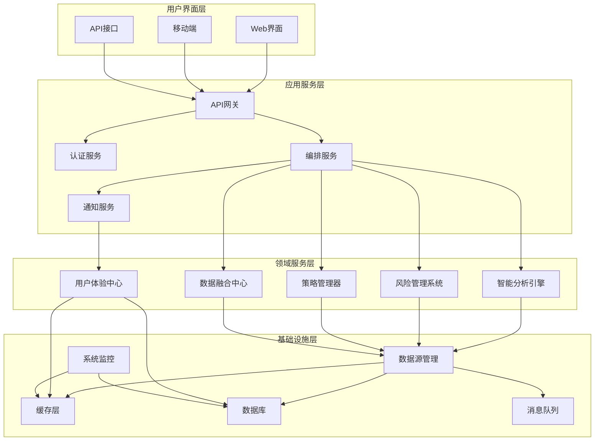
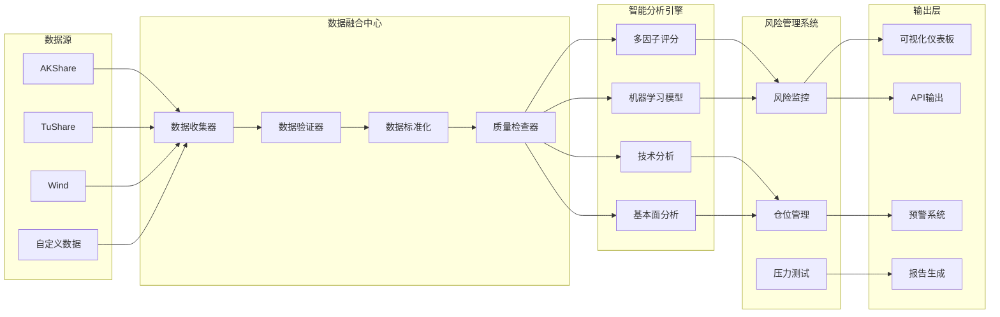

# 巴菲特盯盘系统全面优化架构设计

## 1. 现有系统分析

### 1.1 系统现状评估

基于对现有代码的深入分析，当前巴菲特盯盘系统具有以下特点：

**优势：**
- 采用分层架构设计，模块职责相对清晰
- 实现了基础的股票筛选和监控功能
- 具备信号检测和评分系统
- 支持多种输出格式和通知方式

**局限性：**
- 评分算法相对简单，缺乏多因子综合评估
- 风险控制机制不够完善
- 数据源单一，缺乏容错和备份机制
- 用户体验界面较为基础
- 缺乏市场环境自适应能力
- 监控策略相对固化，灵活性不足

### 1.2 现有架构分析

当前系统采用5层架构：
1. **数据模型层** (`models/`) - 定义数据结构
2. **核心业务层** (`core/`) - 评分算法和配置
3. **数据访问层** (`data/`) - 数据获取和仓储
4. **业务策略层** (`strategies/`) - 筛选和分析策略
5. **工具层** (`utils/`) - 报告和辅助功能

## 2. 系统架构优化设计

### 2.1 整体架构设计

#### 2.1.1 新架构层次结构

```
┌─────────────────────────────────────────────────────────────┐
│                    用户界面层 (UI Layer)                      │
├─────────────────────────────────────────────────────────────┤
│                   应用服务层 (Application Layer)              │
├─────────────────────────────────────────────────────────────┤
│                   领域服务层 (Domain Layer)                   │
├─────────────────────────────────────────────────────────────┤
│                   基础设施层 (Infrastructure Layer)            │
└─────────────────────────────────────────────────────────────┘
```

#### 2.1.2 核心模块设计

**新增核心模块：**

1. **智能分析引擎** (`intelligence/`)
   - 多因子评分引擎
   - 机器学习预测模型
   - 市场情绪分析
   - 行业轮动分析

2. **风险管理系统** (`risk/`)
   - 实时风险监控
   - 止损策略引擎
   - 仓位管理算法
   - 压力测试模块

3. **数据融合中心** (`datafusion/`)
   - 多数据源整合
   - 数据质量监控
   - 实时数据管道
   - 历史数据管理

4. **策略管理器** (`strategy/`)
   - 策略模板库
   - 动态策略组合
   - 回测引擎
   - 策略优化器

5. **用户体验中心** (`ux/`)
   - 可视化仪表板
   - 个性化配置
   - 智能通知系统
   - 移动端适配

### 2.2 架构设计原则

#### 2.2.1 设计原则

1. **微服务化架构**
   - 模块间松耦合，高内聚
   - 支持独立部署和扩展
   - API优先的设计理念

2. **事件驱动架构**
   - 基于事件的消息传递
   - 异步处理机制
   - 实时响应能力

3. **云原生设计**
   - 容器化部署
   - 弹性伸缩能力
   - 高可用性保障

4. **数据驱动决策**
   - 实时数据分析
   - 机器学习辅助
   - 智能化推荐

#### 2.2.2 技术栈选择

**后端技术栈：**
- Python 3.11+ (核心语言)
- FastAPI (API框架)
- Celery (异步任务队列)
- Redis (缓存和消息队列)
- PostgreSQL (主数据库)
- ClickHouse (时序数据)
- Docker (容器化)

**前端技术栈：**
- React + TypeScript (前端框架)
- Ant Design (UI组件库)
- ECharts (数据可视化)
- WebSocket (实时通信)

## 3. 核心功能增强设计

### 3.1 增强技术分析模块

#### 3.1.1 多因子评分系统架构

```python
# 多因子评分引擎设计
class MultiFactorScoringEngine:
    def __init__(self):
        self.factors = {
            'value': ValueFactor(),
            'growth': GrowthFactor(),
            'quality': QualityFactor(),
            'momentum': MomentumFactor(),
            'dividend': DividendFactor(),
            'technical': TechnicalFactor()
        }
        self.weights = AdaptiveWeightManager()
    
    def calculate_composite_score(self, stock: StockInfo, market_context: MarketContext) -> CompositeScore:
        # 市场环境自适应权重调整
        current_weights = self.weights.get_adaptive_weights(market_context)
        
        # 因子评分计算
        factor_scores = {}
        for factor_name, factor in self.factors.items():
            factor_scores[factor_name] = factor.calculate_score(stock, market_context)
        
        # 综合评分计算
        composite_score = self._aggregate_scores(factor_scores, current_weights)
        
        return CompositeScore(
            total_score=composite_score,
            factor_scores=factor_scores,
            weights=current_weights,
            confidence=self._calculate_confidence(factor_scores)
        )
```

#### 3.1.2 技术指标增强

**新增技术指标模块：**

1. **高级技术指标**
   - 布林带分析
   - MACD背离检测
   - RSI超买超卖分析
   - KDJ随机指标
   - 威廉指标

2. **形态识别模块**
   - 支撑阻力位识别
   - 趋势线分析
   - 图表形态识别
   - 缺口分析

3. **量价分析模块**
   - 量价背离检测
   - 成交量分析
   - 资金流向分析
   - 主力资金监控

### 3.2 智能仓位管理模块

#### 3.2.1 仓位管理架构

```python
class IntelligentPositionManager:
    def __init__(self):
        self.risk_manager = RiskManager()
        self.portfolio_optimizer = PortfolioOptimizer()
        self.market_regime_detector = MarketRegimeDetector()
    
    def calculate_optimal_position(self, 
                                 stock: StockInfo, 
                                 portfolio: Portfolio,
                                 market_context: MarketContext) -> PositionDecision:
        # 市场环境识别
        market_regime = self.market_regime_detector.detect_regime(market_context)
        
        # 风险评估
        risk_assessment = self.risk_manager.assess_position_risk(
            stock, portfolio, market_regime
        )
        
        # 投资组合优化
        optimal_weight = self.portfolio_optimizer.optimize_weight(
            stock, portfolio, risk_assessment, market_regime
        )
        
        return PositionDecision(
            stock=stock,
            optimal_weight=optimal_weight,
            risk_level=risk_assessment.risk_level,
            confidence=risk_assessment.confidence,
            reasoning=self._generate_reasoning(stock, market_regime, risk_assessment)
        )
```

#### 3.2.2 动态仓位调整策略

1. **基于波动率的仓位调整**
2. **基于相关性的分散化策略**
3. **基于市场环境的仓位管理**
4. **基于风险预算的仓位分配**

### 3.3 市场环境自适应机制

#### 3.3.1 市场环境识别模块

```python
class MarketEnvironmentDetector:
    def __init__(self):
        self.indicators = {
            'trend': TrendIndicators(),
            'volatility': VolatilityIndicators(),
            'sentiment': SentimentIndicators(),
            'macro': MacroIndicators()
        }
    
    def detect_market_environment(self, market_data: MarketData) -> MarketEnvironment:
        # 多维度环境分析
        trend_analysis = self.indicators['trend'].analyze(market_data)
        volatility_analysis = self.indicators['volatility'].analyze(market_data)
        sentiment_analysis = self.indicators['sentiment'].analyze(market_data)
        macro_analysis = self.indicators['macro'].analyze(market_data)
        
        # 环境分类
        environment_type = self._classify_environment(
            trend_analysis, volatility_analysis, sentiment_analysis, macro_analysis
        )
        
        return MarketEnvironment(
            environment_type=environment_type,
            trend=trend_analysis,
            volatility=volatility_analysis,
            sentiment=sentiment_analysis,
            macro=macro_analysis,
            confidence=self._calculate_confidence()
        )
```

#### 3.3.2 自适应策略调整

1. **牛市环境策略**
   - 成长因子权重提升
   - 动量因子重要性增加
   - 仓位上限适当提高

2. **熊市环境策略**
   - 价值因子权重提升
   - 防御性配置增加
   - 严格风险控制

3.震荡市环境策略**
   - 技术因子重要性增加
   - 短期交易机会关注
   - 灵活仓位管理

## 4. 数据处理优化设计

### 4.1 多数据源整合架构

#### 4.1.1 数据源抽象层

```python
class DataSourceManager:
    def __init__(self):
        self.providers = {
            'akshare': AkShareProvider(),
            'tushare': TuShareProvider(),
            'wind': WindProvider(),
            'choice': ChoiceProvider(),
            'custom': CustomProvider()
        }
        self.quality_checker = DataQualityChecker()
        self.fallback_manager = FallbackManager()
    
    def get_stock_data(self, symbol: str, data_type: str) -> StockData:
        # 数据源优先级策略
        providers_priority = self._get_providers_priority(data_type)
        
        for provider_name in providers_priority:
            try:
                provider = self.providers[provider_name]
                raw_data = provider.get_data(symbol, data_type)
                
                # 数据质量检查
                if self.quality_checker.validate(raw_data):
                    return self._normalize_data(raw_data)
                    
            except Exception as e:
                logger.warning(f"Provider {provider_name} failed: {e}")
                continue
        
        # 降级处理
        return self.fallback_manager.get_cached_data(symbol, data_type)
```

#### 4.1.2 数据质量监控

1. **数据完整性检查**
   - 必要字段缺失检测
   - 数据异常值识别
   - 时间序列连续性验证

2. **数据一致性验证**
   - 多数据源交叉验证
   - 历史数据一致性检查
   - 数据更新时效性监控

3. **数据质量评分**
   - 数据源可靠性评分
   - 数据准确性评估
   - 数据时效性评级

### 4.2 实时数据处理管道

#### 4.2.1 流式处理架构

```python
class RealTimeDataPipeline:
    def __init__(self):
        self.data_sources = DataSourceManager()
        self.processors = [
            DataNormalizer(),
            DataValidator(),
            DataEnricher(),
            SignalDetector(),
            AlertGenerator()
        ]
        self.sinks = [RedisSink(), DatabaseSink(), WebSocketSink()]
    
    async def process_stream(self, data_stream):
        async for raw_data in data_stream:
            try:
                # 流式处理链
                processed_data = raw_data
                for processor in self.processors:
                    processed_data = await processor.process(processed_data)
                
                # 多目标输出
                await asyncio.gather(*[
                    sink.store(processed_data) for sink in self.sinks
                ])
                
            except Exception as e:
                logger.error(f"Processing failed: {e}")
                await self._handle_error(raw_data, e)
```

#### 4.2.2 数据缓存策略

1. **多级缓存架构**
   - L1缓存：内存缓存（Redis）
   - L2缓存：本地缓存
   - L3缓存：数据库缓存

2. **智能缓存策略**
   - 基于访问频率的缓存优先级
   - 基于数据更新频率的缓存失效
   - 预测性数据预加载

### 4.3 数据安全与备份

1. **数据加密存储**
2. **增量备份机制**
3. **灾难恢复方案**
4. **数据访问权限控制**

## 5. 风险控制系统设计

### 5.1 多层次风险管理架构

#### 5.1.1 风险管理层次

```python
class MultiTierRiskManager:
    def __init__(self):
        self.system_risk = SystemRiskManager()
        self.portfolio_risk = PortfolioRiskManager()
        self.position_risk = PositionRiskManager()
        self.operation_risk = OperationRiskManager()
    
    def assess_total_risk(self, portfolio: Portfolio, market_context: MarketContext) -> RiskAssessment:
        # 系统性风险评估
        system_risk = self.system_risk.assess(market_context)
        
        # 投资组合风险评估
        portfolio_risk = self.portfolio_risk.assess(portfolio, market_context)
        
        # 个股风险评估
        position_risks = {}
        for position in portfolio.positions:
            position_risks[position.stock_code] = self.position_risk.assess(
                position, market_context
            )
        
        # 操作风险评估
        operation_risk = self.operation_risk.assess(portfolio)
        
        return RiskAssessment(
            system_risk=system_risk,
            portfolio_risk=portfolio_risk,
            position_risks=position_risks,
            operation_risk=operation_risk,
            overall_risk_score=self._calculate_overall_risk(
                system_risk, portfolio_risk, position_risks, operation_risk
            )
        )
```

#### 5.1.2 风险控制策略

1. **系统性风险控制**
   - 市场风险监控
   - 行业集中度控制
   - 宏观风险评估

2. **投资组合风险控制**
   - 波动率控制
   - 最大回撤限制
   - 相关性监控

3. **个股风险控制**
   - 单一股票仓位限制
   - 止损策略执行
   - 基本面恶化预警

### 5.2 实时风险监控机制

#### 5.2.1 风险预警系统

```python
class RiskAlertSystem:
    def __init__(self):
        self.monitors = {
            'var': VaRMonitor(),
            'drawdown': DrawdownMonitor(),
            'concentration': ConcentrationMonitor(),
            'volatility': VolatilityMonitor(),
            'correlation': CorrelationMonitor()
        }
        self.alert_manager = AlertManager()
    
    def monitor_risks(self, portfolio: Portfolio, market_data: MarketData):
        risk_events = []
        
        for monitor_name, monitor in self.monitors.items():
            try:
                risk_level = monitor.check_risk(portfolio, market_data)
                if risk_level > RiskLevel.NORMAL:
                    risk_events.append(RiskEvent(
                        type=monitor_name,
                        level=risk_level,
                        message=monitor.get_alert_message(),
                        timestamp=datetime.now()
                    ))
            except Exception as e:
                logger.error(f"Risk monitor {monitor_name} failed: {e}")
        
        # 发送风险预警
        if risk_events:
            self.alert_manager.send_alerts(risk_events)
```

#### 5.2.2 动态止损策略

1. **基于波动率的动态止损**
2. **基于技术位的止损调整**
3. **基于基本面变化的止损触发**
4. **基于时间因素的止损优化**

### 5.3 压力测试与情景分析

#### 5.3.1 压力测试框架

```python
class StressTestFramework:
    def __init__(self):
        self.scenarios = ScenarioManager()
        self.calculator = ImpactCalculator()
        self.reporter = StressTestReporter()
    
    def run_stress_test(self, portfolio: Portfolio, test_scenarios: List[Scenario]) -> StressTestResult:
        results = []
        
        for scenario in test_scenarios:
            # 计算情景影响
            portfolio_impact = self.calculator.calculate_impact(
                portfolio, scenario
            )
            
            results.append(ScenarioResult(
                scenario=scenario,
                portfolio_impact=portfolio_impact,
                risk_metrics=self._calculate_risk_metrics(portfolio_impact),
                recommendations=self._generate_recommendations(portfolio_impact)
            ))
        
        return StressTestResult(
            portfolio=portfolio,
            scenario_results=results,
            overall_risk_assessment=self._assess_overall_risk(results),
            generated_at=datetime.now()
        )
```

## 6. 用户体验优化设计

### 6.1 盯盘界面信息架构

#### 6.1.1 可视化仪表板设计

```typescript
interface DashboardLayout {
  header: {
    marketOverview: MarketOverviewWidget;
    quickActions: QuickActionsWidget;
    notifications: NotificationWidget;
  };
  mainContent: {
    portfolioView: PortfolioViewWidget;
    stockAnalysis: StockAnalysisWidget;
    riskMonitor: RiskMonitorWidget;
  };
  sidebar: {
    watchlist: WatchlistWidget;
    alerts: AlertsWidget;
    newsFeed: NewsFeedWidget;
  };
  footer: {
    systemStatus: SystemStatusWidget;
    performanceMetrics: PerformanceMetricsWidget;
  };
}
```

#### 6.1.2 智能信息展示

1. **个性化仪表板**
   - 可自定义布局
   - 智能推荐组件
   - 响应式设计

2. **关键指标突出显示**
   - 重要信号高亮
   - 风险预警提醒
   - 机会识别标识

3. **交互式数据可视化**
   - 实时图表更新
   - 钻取式分析
   - 多维度数据展示

### 6.2 报告和通知系统

#### 6.2.1 智能报告生成

```python
class IntelligentReportGenerator:
    def __init__(self):
        self.templates = ReportTemplateManager()
        self.insights = InsightGenerator()
        self.formatter = ReportFormatter()
    
    def generate_daily_report(self, portfolio: Portfolio, market_data: MarketData) -> DailyReport:
        # 生成关键洞察
        insights = self.insights.generate_insights(portfolio, market_data)
        
        # 选择报告模板
        template = self.templates.select_template(portfolio, market_data)
        
        # 个性化报告内容
        personalized_content = self._personalize_content(
            template, insights, portfolio
        )
        
        return DailyReport(
            summary=self._generate_summary(insights),
            detailed_analysis=personalized_content,
            recommendations=self._generate_recommendations(insights),
            visualizations=self._generate_visualizations(portfolio, market_data),
            generated_at=datetime.now()
        )
```

#### 6.2.2 多渠道通知系统

1. **通知渠道**
   - 实时弹窗通知
   - 邮件报告
   - 短信预警
   - 微信推送
   - 移动端推送

2. **智能通知策略**
   - 基于重要性的通知分级
   - 基于用户偏好的通知过滤
   - 基于时间的通知聚合

### 6.3 个性化配置管理

#### 6.3.1 用户偏好管理

```python
class UserPreferenceManager:
    def __init__(self):
        self.preference_store = PreferenceStore()
        self.profile_analyzer = UserProfileAnalyzer()
        self.recommendation_engine = PreferenceRecommendationEngine()
    
    def get_user_preferences(self, user_id: str) -> UserPreferences:
        # 获取基础偏好
        base_preferences = self.preference_store.get_preferences(user_id)
        
        # 分析用户行为模式
        behavior_profile = self.profile_analyzer.analyze_behavior(user_id)
        
        # 生成个性化推荐
        recommendations = self.recommendation_engine.generate_recommendations(
            base_preferences, behavior_profile
        )
        
        return UserPreferences(
            base_preferences=base_preferences,
            behavior_profile=behavior_profile,
            recommendations=recommendations
        )
```

#### 6.3.2 自适应界面

1. **基于使用习惯的界面优化**
2. **基于专业程度的复杂度调整**
3. **基于设备类型的响应式布局**

## 7. 系统整体架构图

### 7.1 系统架构总览



### 7.2 数据流架构



## 8. 核心算法和数据结构设计

### 8.1 多因子评分算法

#### 8.1.1 因子定义

```python
@dataclass
class FactorDefinition:
    name: str
    description: str
    category: FactorCategory
    weight_range: Tuple[float, float]
    calculation_method: str
    data_requirements: List[str]
    update_frequency: str

class FactorCategory(Enum):
    VALUE = "value"
    GROWTH = "growth"
    QUALITY = "quality"
    MOMENTUM = "momentum"
    DIVIDEND = "dividend"
    TECHNICAL = "technical"
    SENTIMENT = "sentiment"
```

#### 8.1.2 自适应权重算法

```python
class AdaptiveWeightAlgorithm:
    def __init__(self):
        self.market_regime_detector = MarketRegimeDetector()
        self.factor_performance_tracker = FactorPerformanceTracker()
        self.optimizer = WeightOptimizer()
    
    def calculate_adaptive_weights(self, 
                                 base_weights: Dict[str, float],
                                 market_context: MarketContext) -> Dict[str, float]:
        # 市场环境识别
        market_regime = self.market_regime_detector.detect_regime(market_context)
        
        # 因子表现分析
        factor_performance = self.factor_performance_tracker.get_recent_performance(
            market_regime, lookback_days=30
        )
        
        # 权重优化
        optimized_weights = self.optimizer.optimize_weights(
            base_weights, factor_performance, market_regime
        )
        
        return optimized_weights
```

### 8.2 风险管理算法

#### 8.2.1 VaR计算算法

```python
class ValueAtRiskCalculator:
    def __init__(self):
        self.methods = {
            'historical': HistoricalVaR(),
            'parametric': ParametricVaR(),
            'monte_carlo': MonteCarloVaR()
        }
    
    def calculate_var(self, 
                     portfolio: Portfolio, 
                     confidence_level: float = 0.95,
                     time_horizon: int = 1) -> VaRResult:
        results = {}
        
        for method_name, method in self.methods.items():
            try:
                var_value = method.calculate(portfolio, confidence_level, time_horizon)
                results[method_name] = var_value
            except Exception as e:
                logger.error(f"VaR calculation failed for {method_name}: {e}")
        
        # 综合VaR结果
        combined_var = self._combine_var_results(results)
        
        return VaRResult(
            individual_results=results,
            combined_var=combined_var,
            confidence_level=confidence_level,
            time_horizon=time_horizon,
            calculated_at=datetime.now()
        )
```

#### 8.2.2 最大回撤计算

```python
class MaxDrawdownCalculator:
    def calculate_max_drawdown(self, portfolio_values: List[float]) -> DrawdownResult:
        if not portfolio_values:
            return DrawdownResult(0, 0, 0, 0)
        
        peak = portfolio_values[0]
        max_drawdown = 0
        peak_index = 0
        trough_index = 0
        current_peak = portfolio_values[0]
        
        for i, value in enumerate(portfolio_values):
            if value > current_peak:
                current_peak = value
                peak_index = i
            
            drawdown = (current_peak - value) / current_peak
            if drawdown > max_drawdown:
                max_drawdown = drawdown
                trough_index = i
        
        return DrawdownResult(
            max_drawdown=max_drawdown,
            peak_value=portfolio_values[peak_index],
            trough_value=portfolio_values[trough_index],
            peak_index=peak_index,
            trough_index=trough_index,
            duration=trough_index - peak_index
        )
```

### 8.3 数据结构设计

#### 8.3.1 核心数据模型

```python
@dataclass
class EnhancedStockInfo(StockInfo):
    # 基础信息
    sector: str
    industry: str
    market_cap_tier: MarketCapTier
    
    # 财务指标
    roe: float
    roa: float
    debt_to_equity: float
    current_ratio: float
    revenue_growth: float
    earnings_growth: float
    
    # 技术指标
    rsi: float
    macd: float
    bollinger_position: float
    volume_ratio: float
    
    # 市场情绪
    sentiment_score: float
    news_sentiment: float
    analyst_rating: float
    
    # 因子评分
    factor_scores: Dict[str, float]
    composite_score: float
    
    # 风险指标
    beta: float
    volatility: float
    var_95: float
    max_drawdown: float

@dataclass
class MarketContext:
    market_regime: MarketRegime
    volatility_level: VolatilityLevel
    sentiment_index: float
    macro_indicators: Dict[str, float]
    sector_performance: Dict[str, float]
    risk_free_rate: float
    market_return: float
    
@dataclass
class RiskAssessment:
    system_risk: SystemRisk
    portfolio_risk: PortfolioRisk
    position_risks: Dict[str, PositionRisk]
    operation_risk: OperationRisk
    overall_risk_score: float
    risk_factors: List[RiskFactor]
    recommendations: List[RiskRecommendation]
```

## 9. 接口设计和扩展点规划

### 9.1 API接口设计

#### 9.1.1 RESTful API设计

```python
# 股票分析API
@app.get("/api/v1/stocks/{symbol}/analysis")
async def get_stock_analysis(symbol: str, 
                           include_factors: bool = True,
                           include_risk: bool = True) -> StockAnalysisResponse:
    """获取股票综合分析"""
    pass

# 投资组合管理API
@app.post("/api/v1/portfolio/optimize")
async def optimize_portfolio(request: PortfolioOptimizationRequest) -> PortfolioOptimizationResponse:
    """投资组合优化"""
    pass

# 风险评估API
@app.post("/api/v1/risk/assess")
async def assess_risk(request: RiskAssessmentRequest) -> RiskAssessmentResponse:
    """风险评估"""
    pass

# 策略回测API
@app.post("/api/v1/strategy/backtest")
async def backtest_strategy(request: BacktestRequest) -> BacktestResponse:
    """策略回测"""
    pass
```

#### 9.1.2 WebSocket实时接口

```python
class WebSocketManager:
    def __init__(self):
        self.connections: Dict[str, WebSocket] = {}
        self.subscribers: Dict[str, List[str]] = {}
    
    async def subscribe_stock_updates(self, websocket: WebSocket, symbols: List[str]):
        """订阅股票实时更新"""
        connection_id = self._generate_connection_id()
        self.connections[connection_id] = websocket
        
        for symbol in symbols:
            if symbol not in self.subscribers:
                self.subscribers[symbol] = []
            self.subscribers[symbol].append(connection_id)
    
    async def broadcast_stock_update(self, symbol: str, data: StockUpdate):
        """广播股票更新"""
        if symbol in self.subscribers:
            for connection_id in self.subscribers[symbol]:
                if connection_id in self.connections:
                    websocket = self.connections[connection_id]
                    await websocket.send_json(data)
```

### 9.2 扩展点设计

#### 9.2.1 插件架构

```python
class PluginManager:
    def __init__(self):
        self.plugins: Dict[str, Plugin] = {}
        self.hooks: Dict[str, List[Hook]] = {}
    
    def register_plugin(self, plugin: Plugin):
        """注册插件"""
        self.plugins[plugin.name] = plugin
        
        # 注册钩子
        for hook_name, hook_func in plugin.hooks.items():
            if hook_name not in self.hooks:
                self.hooks[hook_name] = []
            self.hooks[hook_name].append(hook_func)
    
    def execute_hooks(self, hook_name: str, *args, **kwargs):
        """执行钩子"""
        if hook_name in self.hooks:
            for hook_func in self.hooks[hook_name]:
                try:
                    hook_func(*args, **kwargs)
                except Exception as e:
                    logger.error(f"Hook execution failed: {e}")

class Plugin(ABC):
    @property
    @abstractmethod
    def name(self) -> str:
        pass
    
    @property
    @abstractmethod
    def version(self) -> str:
        pass
    
    @property
    @abstractmethod
    def hooks(self) -> Dict[str, callable]:
        pass
    
    @abstractmethod
    def initialize(self):
        pass
    
    @abstractmethod
    def cleanup(self):
        pass
```

#### 9.2.2 策略扩展接口

```python
class StrategyInterface(ABC):
    @abstractmethod
    def initialize(self, config: StrategyConfig):
        """策略初始化"""
        pass
    
    @abstractmethod
    def analyze(self, stock: StockInfo, market_context: MarketContext) -> AnalysisResult:
        """股票分析"""
        pass
    
    @abstractmethod
    def generate_signals(self, analysis: AnalysisResult) -> List[TradingSignal]:
        """生成交易信号"""
        pass
    
    @abstractmethod
    def calculate_position_size(self, signal: TradingSignal, portfolio: Portfolio) -> float:
        """计算仓位大小"""
        pass

# 自定义策略示例
class CustomMomentumStrategy(StrategyInterface):
    def __init__(self):
        self.momentum_calculator = MomentumCalculator()
        self.risk_adjuster = RiskAdjuster()
    
    def analyze(self, stock: StockInfo, market_context: MarketContext) -> AnalysisResult:
        momentum_score = self.momentum_calculator.calculate(stock)
        risk_adjusted_score = self.risk_adjuster.adjust(momentum_score, stock, market_context)
        
        return AnalysisResult(
            stock=stock,
            momentum_score=momentum_score,
            risk_adjusted_score=risk_adjusted_score,
            recommendation=self._generate_recommendation(risk_adjusted_score)
        )
```

## 10. 实施路径和优先级排序

### 10.1 实施阶段规划

#### 10.1.1 第一阶段：基础架构优化（1-2个月）

**优先级：高**

1. **数据层重构**
   - 多数据源整合
   - 数据质量监控
   - 缓存机制优化

2. **核心评分系统升级**
   - 多因子评分框架
   - 自适应权重算法
   - 因子性能跟踪

3. **风险管理系统基础**
   - 实时风险监控
   - 基础风险指标
   - 预警机制

#### 10.1.2 第二阶段：智能化增强（2-3个月）

**优先级：中**

1. **机器学习模型集成**
   - 预测模型训练
   - 模型评估框架
   - 模型部署机制

2. **策略管理器开发**
   - 策略模板库
   - 回测引擎
   - 策略优化器

3. **用户体验优化**
   - 可视化仪表板
   - 个性化配置
   - 智能通知系统

#### 10.1.3 第三阶段：高级功能完善（3-4个月）

**优先级：中低**

1. **高级风险管理**
   - 压力测试框架
   - 情景分析
   - 动态仓位管理

2. **市场环境自适应**
   - 环境识别算法
   - 自适应策略调整
   - 智能参数优化

3. **生态系统建设**
   - 插件架构
   - API开放平台
   - 第三方集成

### 10.2 技术债务处理

#### 10.2.1 代码重构优先级

1. **高优先级重构**
   - 数据访问层统一化
   - 异常处理标准化
   - 日志系统完善

2. **中优先级重构**
   - 配置管理统一化
   - 测试覆盖率提升
   - 性能优化

3. **低优先级重构**
   - 代码风格统一
   - 文档完善
   - 示例代码补充

### 10.3 风险控制措施

#### 10.3.1 开发风险控制

1. **代码质量保障**
   - 代码审查机制
   - 自动化测试
   - 持续集成

2. **系统稳定性保障**
   - 灰度发布
   - 回滚机制
   - 监控告警

3. **数据安全保障**
   - 数据备份
   - 访问控制
   - 加密传输

## 11. 总结

本优化方案设计从系统架构、核心功能、数据处理、风险控制、用户体验等多个维度对巴菲特盯盘系统进行了全面的升级规划。主要特点包括：

### 11.1 核心优势

1. **智能化程度显著提升**
   - 多因子评分系统
   - 机器学习辅助决策
   - 市场环境自适应

2. **风险管理能力增强**
   - 多层次风险控制
   - 实时风险监控
   - 动态止损策略

3. **数据处理能力提升**
   - 多数据源整合
   - 实时数据处理
   - 数据质量保障

4. **用户体验大幅改善**
   - 可视化仪表板
   - 个性化配置
   - 智能通知系统

### 11.2 技术创新点

1. **自适应权重算法**
2. **市场环境识别机制**
3. **多因子评分框架**
4. **插件化架构设计**
5. **实时风险监控引擎**

### 11.3 实施可行性

1. **技术栈成熟可靠**
2. **分阶段实施降低风险**
3. **向后兼容保证平滑过渡**
4. **模块化设计便于维护**

这个优化方案将为巴菲特盯盘系统提供企业级的技术架构和智能化能力，使其在投资决策支持、风险控制和用户体验方面达到行业领先水平。