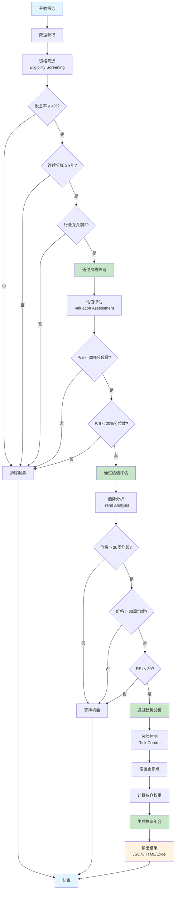
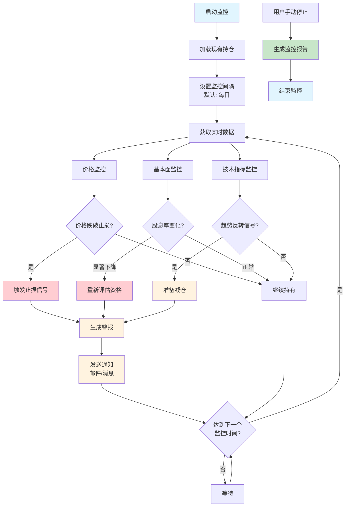
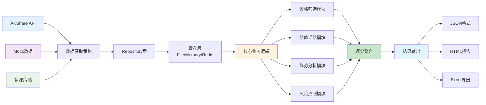

# Buffett 股息筛选系统 2.0

现代化企业级股息股票筛选系统，基于SOLID原则和设计模式的可扩展架构。

## 🏗️ 架构特色

- **现代化Python架构**: 采用src/布局的企业级项目结构
- **类型安全**: 100%类型注解，Pydantic v2模型验证
- **依赖注入**: 功能完整的DI容器，支持生命周期管理
- **设计模式**: Repository、Strategy、Factory模式的完整实现
- **SOLID原则**: 严格遵循单一职责、开闭原则等设计原则
- **测试覆盖**: pytest + pytest-asyncio，完整的测试体系

## 🚀 快速开始

### 环境要求
- Python 3.8+ (推荐 3.11)
- 使用 UV 进行现代化依赖管理

### 安装和运行

```bash
# 克隆项目
git clone <repository-url>
cd buffett

# 使用UV安装依赖和管理
uv sync                    # 安装所有依赖
```

### 基本使用

```bash
# 显示系统配置
uv run python main.py config

# 运行股票筛选
uv run python main.py screen

# 查看帮助信息
uv run python main.py --help
```

## 🔄 系统工作流程

### 股票筛选流程



### 持续监控流程



### 架构数据流



## 🏛️ 现代化架构

### 核心架构层次

```
src/buffett/                    # 应用根目录
├── core/                      # 核心架构组件
│   ├── container.py            # 依赖注入容器
│   └── screening.py           # 筛选核心逻辑
├── models/                    # 数据模型层
│   ├── stock.py              # 股票基础模型
│   ├── screening.py          # 筛选结果模型
│   └── industry.py           # 行业模型
├── interfaces/               # 接口定义层
│   ├── repositories.py        # Repository接口
│   ├── services.py           # 服务接口
│   └── providers.py          # 提供者接口
├── data/                      # 数据访问层
│   └── repositories/         # Repository实现
├── strategies/               # 策略模式实现
│   └── data_fetch_strategies.py
├── factories/                # 工厂模式实现
│   ├── repository_factory.py
│   └── strategy_factory.py
├── config/                    # 配置管理
│   └── settings.py
└── exceptions/                # 异常处理
```

### 设计模式应用

#### 1. Repository Pattern
```python
# 接口定义
from buffett.interfaces.repositories import IStockRepository

# 具体实现
from buffett.data.repositories.stock_repository import StockRepository

# 工厂创建
from buffett.factories.repository_factory import RepositoryFactory
stock_repo = RepositoryFactory.create_repository("stock")
```

#### 2. Strategy Pattern
```python
# 策略接口
from buffett.strategies.data_fetch_strategies import DataFetchStrategy

# 具体策略
from buffett.strategies.data_fetch_strategies import AKShareStrategy, MockStrategy

# 策略上下文
from buffett.strategies.data_fetch_strategies import DataFetchContext
context = DataFetchContext(strategy)
```

#### 3. Factory Pattern
```python
# Repository工厂
from buffett.factories.repository_factory import RepositoryFactory
repo = RepositoryFactory.create_for_production()

# 策略工厂
from buffett.factories.strategy_factory import StrategyFactory
strategy = StrategyFactory.create_for_testing()
```

#### 4. Dependency Injection
```python
from buffett.core.container import get_container

# 注册服务
container = get_container()
container.register_singleton(IStockRepository, StockRepository)
container.register_transient(IDataService, DataService)

# 自动注入
service = container.resolve(IDataService)
```

## 🧪 测试体系

### 测试结构
```
tests/
├── unit/                      # 单元测试
│   ├── test_models.py       # 模型测试
│   ├── test_container.py    # 容器测试
│   ├── test_repositories.py # Repository测试
│   └── test_design_patterns.py # 设计模式测试
├── conftest.py                # 测试配置
└── integration/              # 集成测试
```

### 运行测试

```bash
# 运行所有测试
uv run pytest

# 运行特定测试
uv run pytest tests/unit/test_models.py

# 运行测试并生成覆盖率报告
uv run pytest --cov=src/buffett --cov-report=html
```

## 📊 配置系统

### 环境变量配置
```bash
# .env 文件
BUFFETT_ENVIRONMENT=production
BUFFETT_DATA_SOURCE=multi_source
BUFFETT_CACHE_BACKEND=file
BUFFETT_LOG_LEVEL=INFO
```

### 配置文件结构
```python
from buffett.config.settings import get_settings

settings = get_settings()
print(f"筛选配置: {settings.screening.min_dividend_yield}%")
```

### 多环境支持
```python
# 测试环境
from buffett.factories import RepositoryFactory
test_factory = RepositoryFactory.create_for_testing()

# 生产环境
prod_factory = RepositoryFactory.create_for_production()

# 开发环境
dev_factory = RepositoryFactory.create_for_development()
```

## 🔍 数据源支持

### 多源策略
- **AKShare**: 主要数据源，支持A股实时数据
- **Mock**: 测试数据源，提供稳定测试环境
- **Multi-Source**: 多源回退机制，确保数据可靠性

### 策略切换
```python
from buffett.factories.strategy_factory import DataSourceType

# 测试环境使用Mock数据
factory = StrategyFactory.create_for_testing()
strategy = factory.create_data_fetch_strategy(DataSourceType.MOCK)

# 生产环境使用多源策略
factory = StrategyFactory.create_for_production()
strategy = factory.create_data_fetch_strategy(DataSourceType.MULTI_SOURCE)
```

## 🚀 API 使用示例

### 基础操作
```python
import asyncio
from buffett.factories import RepositoryFactory

async def main():
    # 创建Repository
    repo_factory = RepositoryFactory.create_for_production()
    stock_repo = repo_factory.create_repository(RepositoryType.STOCK)

    # 获取所有股票
    stocks = await stock_repo.get_all_stocks()
    print(f"获取到 {len(stocks)} 只股票")
```

### 高级配置
```python
from buffett.strategies import DataFetchContext
from buffett.factories import StrategyFactory

async def advanced_screening():
    # 创建策略
    factory = StrategyFactory.create_for_production()
    strategy = factory.create_data_fetch_strategy("multi_source")

    # 创建上下文
    context = DataFetchContext(strategy)

    # 获取数据
    stocks = await context.fetch_all_stocks()
    dividends = await context.fetch_dividend_data("000001.SZ")

    return stocks, dividends
```

## 🧹 开发指南

### 代码质量工具
```bash
# 代码格式化
uv run black src/ tests/

# 类型检查
uv run mypy src/

# 代码导入排序
uv run isort src/ tests/

# 代码质量检查
uv run flake8 src/ tests/
```

### 依赖管理
```bash
# 添加新依赖
uv add numpy pandas

# 添加开发依赖
uv add --dev pytest black isort mypy

# 更新依赖
uv sync --upgrade

# 生成依赖树
uv tree
```

### 调试和监控
```bash
# 开发模式运行
BUFFETT_ENVIRONMENT=development uv run python main.py config

# 详细日志输出
uv run python main.py screen --verbose
```

## 📈 架构优势

### 1. 可扩展性
- 通过接口抽象支持多种数据源
- 工厂模式便于添加新的实现
- 策略模式支持算法可插拔

### 2. 可维护性
- 清晰的分层架构
- 单一的设计模式应用
- 完整的类型注解覆盖

### 3. 可测试性
- 依赖注入便于Mock和测试
- 完整的单元测试覆盖
- 清晰的测试结构

### 4. 可配置性
- 环境驱动的配置管理
- 多环境配置支持
- 类型安全的配置验证

## 🔍 最佳实践

### 1. 代码规范
- 遵循PEP 8代码风格
- 使用类型注解
- 编写清晰的文档字符串

### 2. 错误处理
- 使用结构化异常体系
- 提供有意义的错误信息
- 实现优雅的降级机制

### 3. 性能优化
- 合理的缓存策略
- 异步操作支持
- 批处理数据处理

### 4. 安全考虑
- 敏感信息环境变量化
- 输入数据验证
- 错误信息避免信息泄露

## 🚀 贡献指南

### 开发流程
1. Fork 项目
2. 创建功能分支: `feature/your-feature`
3. 实现功能并添加测试
4. 确保所有测试通过
5. 提交PR

### 代码规范
- 遵循项目的代码风格
- 添加必要的测试覆盖
- 更新相关文档

### 提交规范
- 使用清晰的提交信息
- 一个提交只做一件事
- 相关的变更一起提交

## 📋 许可证

本项目采用MIT许可证，详见[LICENSE](LICENSE)文件。

## 📞 联系方式

- **Issues**: [提交GitHub Issues](../../issues)
- **Pull Requests**: [提交Pull Requests](../../pulls)

---

**免责声明**: 本软件仅供教育和研究目的使用。投资有风险，请根据自身情况谨慎投资。